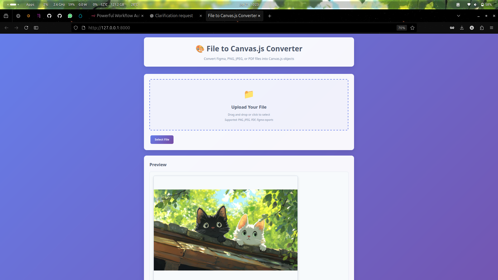
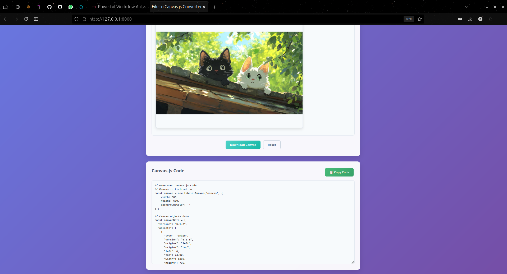

# File to Canvas.js Converter

A powerful web application that converts various file types (Figma, PNG, JPEG, PDF) into Canvas.js objects with editable code output.

## Features

- **Multi-format Support**: Upload PNG, JPEG, PDF, and Figma files
- **Interactive Canvas**: Preview your converted files on an interactive canvas
- **Code Generation**: Automatically generates Canvas.js code for your uploaded files
- **Easy Copy**: One-click code copying to clipboard
- **Download**: Export your canvas as PNG image
- **Responsive Design**: Works perfectly on desktop and mobile devices
- **Drag & Drop**: Simply drag and drop files to upload

## Supported File Types

| Format | Extension | Description |
|--------|-----------|-------------|
| PNG | `.png` | Portable Network Graphics images |
| JPEG | `.jpg`, `.jpeg` | JPEG images |
| PDF | `.pdf` | PDF documents (converts first page) |
| Figma | `.fig` | Figma design files (limited support) |

## Screenshots

### Main Interface


### File Processing View


## How to Use

1. **Upload a File**: 
   - Click the "Select File" button or drag and drop a file onto the upload area
   - Supported formats: PNG, JPEG, PDF, Figma export

2. **Preview**: 
   - View your file rendered on the interactive canvas
   - The canvas automatically scales content to fit

3. **Get the Code**: 
   - Canvas.js code is automatically generated
   - Copy the code using the "Copy Code" button
   - Use the generated code in your own projects

4. **Download**: 
   - Export your canvas as a PNG image
   - Reset the canvas to start over


## Dependencies

- [Fabric.js](https://fabricjs.com/) - Canvas manipulation library
- [PDF.js](https://mozilla.github.io/pdf.js/) - PDF processing library

## File Structure

```
/
├── index.html          # Main HTML file
├── styles.css          # CSS styles
├── script.js           # JavaScript functionality
└── README.md          # This file
```

## Features in Detail

### Image Processing
- Automatically scales images to fit the canvas
- Maintains aspect ratio
- Converts to Fabric.js Image objects
- Generates both JSON and manual creation code

### PDF Processing
- Renders the first page of PDF documents
- Converts PDF to canvas using PDF.js
- Scales content to fit the display canvas
- Maintains document quality

### Figma File Support
- Basic Figma file parsing
- Creates placeholder content for Figma designs
- Note: Full Figma import requires Figma API integration

### Code Generation
The tool generates two types of Canvas.js code:

1. **JSON-based loading**: Complete canvas state as JSON
2. **Manual object creation**: Individual object creation code
3. **Utility functions**: Helper functions for canvas manipulation

## Generated Code Structure

```javascript
// Canvas initialization
const canvas = new fabric.Canvas('canvas', {
    width: 800,
    height: 600,
    backgroundColor: '#ffffff'
});

// Load from JSON (recommended)
canvas.loadFromJSON(canvasData, function() {
    canvas.renderAll();
});

// Or create objects manually
const image = new fabric.Image(imgElement, {
    left: 100,
    top: 100,
    scaleX: 0.5,
    scaleY: 0.5
});
canvas.add(image);
```

## Browser Compatibility

- Chrome 60+
- Firefox 55+
- Safari 12+
- Edge 79+

## Technical Implementation

### File Reading
- Uses FileReader API for file processing
- Supports both file selection and drag-and-drop
- Handles multiple file types with appropriate processors

### Canvas Rendering
- Fabric.js for interactive canvas functionality
- Automatic scaling and positioning
- Object manipulation support

### Code Generation
- Dynamic JavaScript code generation
- JSON serialization of canvas state
- Manual object creation code for flexibility

## Customization

### Adding New File Types
To add support for new file types:

1. Update the file input `accept` attribute
2. Add a new processor function in `script.js`
3. Update the file type detection logic
4. Add appropriate error handling

### Styling Customization
- Modify `styles.css` for visual changes
- Responsive design with CSS Grid and Flexbox
- CSS custom properties for easy theming

## Limitations

- Figma files require API integration for full support
- PDF processing limited to first page
- Large files may take time to process
- Browser memory limitations for very large images

## Contributing

1. Fork the repository
2. Create a feature branch
3. Make your changes
4. Test thoroughly
5. Submit a pull request

## License

This project is open source and available under the MIT License.

## Support

For questions or issues:
1. Check the browser console for error messages
2. Ensure your file is in a supported format
3. Try with a smaller file size if processing fails
4. Check browser compatibility

## Future Enhancements

- [ ] Full Figma API integration
- [ ] Multiple PDF pages support
- [ ] SVG file support
- [ ] Advanced canvas editing tools
- [ ] Export to multiple formats
- [ ] Cloud storage integration
- [ ] Batch file processing
- [ ] Custom canvas templates
